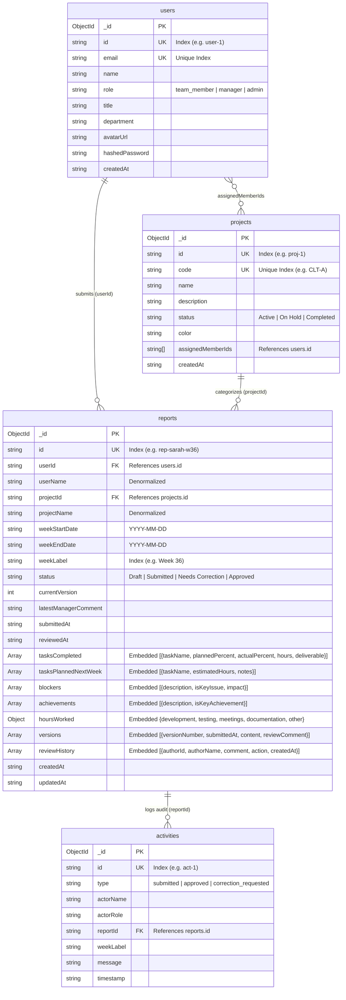

# Backend Architecture & System Design Documentation

## 1. Architectural Overview

The **Weekly Report Generator & Team Dashboard** backend is engineered as a high-performance, asynchronous REST API powered by **FastAPI**, **MongoDB (Motor)**, **Pydantic v2**, and a lightweight AI intelligence layer orchestrating **LangGraph**, **LangChain**, and **ChatGroq**.

The system adheres strictly to a **Three-Tier Layered Architecture**:
1. **API / Route Layer (`app/routes/`)**: Handles HTTP requests, enforces JWT authentication, validates payload schemas, and delegates immediately to the domain service layer.
2. **Domain Service Layer (`app/services/`)**: Encapsulates business logic, state transitions, KPI aggregations, manager approval workflows, audit event generation, and AI agent orchestration.
3. **Persistence Repository Layer (`app/repositories/`)**: Manages asynchronous database queries against MongoDB, dynamic filter building, pagination slicing, and atomic document updates.

```
┌────────────────────────────────────────────────────────────────────────────────────────┐
│                                   CLIENT LAYER                                         │
│                      React 19 + TypeScript + Zustand Frontend                          │
└───────────────────────────────────────────┬────────────────────────────────────────────┘
                                            │ HTTP / REST (JWT Bearer)
                                            ▼
┌────────────────────────────────────────────────────────────────────────────────────────┐
│                                 FASTAPI API GATEWAY                                    │
│  ┌────────────────────────┐  ┌───────────────────────────┐  ┌───────────────────────┐  │
│  │   Auth & RBAC Guards   │  │   CORS & Request Context  │  │ OpenAPI / Swagger     │  │
│  │ (require_authenticated)│  │      (CORSMiddleware)     │  │     (/docs, /redoc)   │  │
│  └───────────┬────────────┘  └─────────────┬─────────────┘  └───────────┬───────────┘  │
└──────────────┼─────────────────────────────┼────────────────────────────┼──────────────┘
               ▼                             ▼                            ▼
┌────────────────────────────────────────────────────────────────────────────────────────┐
│                              ROUTERS (CONTROLLER LAYER)                                │
│       `user_routes.py`          `report_routes.py`           `chat_routes.py`          │
└────────────────────────────────────────────┬───────────────────────────────────────────┘
                                             │
                                             ▼
┌────────────────────────────────────────────────────────────────────────────────────────┐
│                                 DOMAIN SERVICE LAYER                                   │
│  ┌─────────────────────────┐  ┌─────────────────────────┐  ┌────────────────────────┐  │
│  │     ReportService       │  │       UserService       │  │      ChatService       │  │
│  │ • KPI Computations      │  │ • User authentication   │  │ • Session QnA Flow     │  │
│  │ • Version Snapshots     │  │ • Profile resolution    │  │ • LangGraph StateGraph │  │
│  │ • Approval State Machine│  │ • Role administration   │  │ • 5-turn Summarizer    │  │
│  │ • Audit Activity Events │  │                         │  │ • Lightweight RAG Flow │  │
│  └───────────┬─────────────┘  └────────────┬────────────┘  └───────────┬────────────┘  │
└──────────────┼─────────────────────────────┼───────────────────────────┼───────────────┘
               │                             │                           │
               ▼                             ▼                           ▼
┌────────────────────────────────────────────────────────────────────────────────────────┐
│                             PERSISTENCE REPOSITORY LAYER                               │
│       `report_repository.py`      `user_repository.py`      `chat_repository.py`       │
│       (Async Motor Queries, Dynamic MongoDB Aggregation Pipelines, Pagination)        │
└────────────────────────────────────────────┬───────────────────────────────────────────┘
                                             │
                                             ▼
┌────────────────────────────────────────────────────────────────────────────────────────┐
│                                   DATABASE LAYER                                       │
│                       MongoDB 7.0 (Collections & Indexes)                              │
│       • `users`          • `projects`          • `weekly_reports`    • `activities`    │
└────────────────────────────────────────────────────────────────────────────────────────┘
```

---

## 2. Directory Structure & Module Responsibilities

```
backend/
├── app/
│   ├── clients/
│   │   └── database/
│   │       └── mongo_client.py     # Motor async client, connection pool, and auto-seeder
│   │
│   ├── data/
│   │   └── mock_data.py            # Initial seed dataset (users, projects, reports, activities)
│   │
│   ├── llm/                        # Enterprise LLM Provider Factory
│   │   ├── LLMFactory.py           # Provider registry & model instantiation
│   │   ├── LLMProvider.py          # Abstract base class for LLM providers
│   │   ├── tiers.py                # Tier configs: SMALL (Summarizer), STANDARD (QnA RAG), LARGE
│   │   └── clients/
│   │       └── groq_client.py      # Groq client & ChatGroq provider
│   │
│   ├── middleware/
│   │   └── auth.py                 # JWT token creation/verification & RBAC dependency guards
│   │
│   ├── models/                     # Pydantic v2 schemas
│   │   ├── users.py                # UserModel, UserCreate, LoginRequest, AuthResponse
│   │   ├── reports.py              # WeeklyReportModel, Tasks, Blockers, KPI Metrics, Projects
│   │   └── chats.py                # ActivityFeedModel, ChatQueryRequest, ChatQueryResponse
│   │
│   ├── repositories/               # Low-level async database data access
│   │   ├── report_repository.py    # Report CRUD, filtering, pagination, versions
│   │   ├── user_repository.py      # User retrieval, credentials lookup, role updates
│   │   └── chat_repository.py      # Real-time activity logging and feed queries
│   │
│   ├── routes/                     # FastAPI endpoint controllers
│   │   ├── user_routes.py          # Auth endpoints (/api/users/login, /api/users/me, roles)
│   │   ├── report_routes.py        # Report CRUD, submit, review, metrics, projects
│   │   └── chat_routes.py          # Audit activity feed (/activities) & Chatbot (/chat/ask)
│   │
│   └── services/                   # High-level domain business logic
│       ├── reports/
│       │   └── report_service.py   # State transitions, KPI calculations, audit events
│       └── chat/
│           ├── chat_service.py     # Chat coordinator bridging REST to LangGraph
│           ├── graph.py            # LangGraph StateGraph (QnA node, 5-turn Summarizer)
│           └── rag.py              # Lightweight LangChain RAG Engine & Context Retrieval
│
├── Dockerfile                      # Production container build
├── main.py                         # FastAPI application entrypoint & lifespan
├── requirements.txt                # Python dependencies
└── .env.example                    # Environment variable template
```

---

## 3. Role-Based Access Control (RBAC) & Security

The API enforces strict RBAC rules at the route layer using FastAPI dependency injection.

### 3.1 User Roles
- **`team_member` (Contributor)**:
  - Can create and update their own draft reports.
  - Can submit reports for review.
  - Can view team dashboard metrics, project lists, and recent activity logs.
  - Can converse with the AI Intelligence Assistant.
  - **Restricted from**: Approving/rejecting reports, changing other users' reports, modifying user roles.
- **`manager` (Engineering Lead)**:
  - Inherits all Contributor capabilities.
  - Can review submitted reports (Approve or Request Corrections with structured comments).
  - Can filter and inspect all team member submissions across all projects and weeks.
- **`admin` (System Administrator)**:
  - Inherits all Manager and Contributor capabilities.
  - Can modify user roles (`PUT /api/users/{user_id}/role`).
  - Full authority over projects, reports, and administrative operations.

### 3.2 Security Middleware & Helpers (`app/middleware/auth.py`)

| Dependency / Guard | Description | Failure Response |
| :--- | :--- | :--- |
| `require_authenticated` | Verifies JWT Bearer token and retrieves active user profile | `401 Unauthorized` |
| `require_manager_or_admin` | Requires user role to be `manager` or `admin` | `403 Forbidden` |
| `require_admin` | Requires user role to be strictly `admin` | `403 Forbidden` |

### 3.3 Authentication Workflow
1. User posts credentials to `POST /api/users/login`.
2. Password hash verified using **Bcrypt** with salt rounds.
3. Returns signed **JWT** containing user ID, email, role, and expiration (`ACCESS_TOKEN_EXPIRE_MINUTES`).
4. Client provides token via `Authorization: Bearer <token>` on all authenticated endpoints.

---

## 4. Domain Service Layer Architecture

Business logic is isolated from HTTP handling inside `app/services/`:

### 4.1 Report Service (`app/services/reports/report_service.py`)
- **Draft Preservation**: `save_draft` updates the working copy without triggering reviews or locking fields.
- **Submission & Snapshotting**: `submit_report` transitions status to `"Submitted"`, stamps `submittedAt`, and appends an immutable snapshot to the `versions` array.
- **Manager Review Action Machine**:
  - `approve`: Transitions status to `"Approved"`, records reviewer comments in `reviewHistory`, and logs an activity audit entry.
  - `request_changes`: Transitions status to `"Needs Correction"`, stores feedback, and notifies contributor.
- **KPI Metrics Engine (`calculate_metrics`)**:
  - Computes submission compliance rate: `(totalSubmittedThisWeek / totalTeamMembers) * 100`.
  - Aggregates approved submissions, pending reviews, correction requests, and open blockers.
- **Audit Logging**: Emits structured activity events to `activities` collection on every lifecycle transition.

### 4.2 Chat Service & Agent Orchestration (`app/services/chat/`)
- **Session-Only Memory**: Maintains dialogue context in-memory using LangGraph's `MemorySaver`. When the client refreshes, the thread ID changes, providing a fresh session without persisting chat logs to the database.
- **Two-Node Graph Workflow**:
  1. `qna_node`: Executes the **Lightweight LangChain RAG Engine** (`rag.py`), using direct async MongoDB queries to retrieve weekly submissions, KPI metrics, and blockers.
  2. `summarize_node`: Triggers automatically every 5 user responses, compressing dialogue into a 150-word rolling context summary using Groq's Tier 1 model.

---

## 5. AI Assistant: LangGraph, LangChain & Groq Lightweight RAG

### 5.1 Architecture Diagram

```
                 User Query + Selected Week
                             │
                             ▼
               ┌───────────────────────────┐
               │    LangGraph StateGraph   │
               │       (chat_graph)        │
               │   • MemorySaver Session   │
               └─────────────┬─────────────┘
                             │
                             ▼
               ┌───────────────────────────┐
               │         qna_node          │
               │  (`run_lightweight_rag`)  │
               └─────────────┬─────────────┘
                             │
            ┌────────────────┴────────────────┐
            │ Direct Async MongoDB Retrieval  │
            │ • calculate_metrics(week)       │
            │ • get_reports(week, search)     │
            │ • get_all_projects()            │
            └────────────────┬────────────────┘
                             │
                             ▼
               ┌───────────────────────────┐
               │ Structured Context Prompt │
               │ • Contributors & Tasks    │
               │ • Blocker Key Issue Flags │
               │ • Live Compliance Rates   │
               │ • Prior Rolling Summary   │
               └─────────────┬─────────────┘
                             │
                             ▼
               ┌───────────────────────────┐
               │      LangChain ChatGroq   │
               │    (qwen/qwen3.8-27b)     │
               └─────────────┬─────────────┘
                             │
                     Synthesized Reply
                             │
                             ▼
               ┌───────────────────────────┐
               │ Conditional Edge:         │
               │ response_count % 5 == 0 ? │
               └───────┬───────────┬───────┘
                  YES  │           │ NO
                       ▼           ▼
               ┌────────────────┐ END
               │ summarize_node │
               │  (Groq Tier 1) │
               └───────┬────────┘
                       ▼
                      END (Returns Reply + Rolling Summary)
```

### 5.2 Pure Asynchronous Context Retrieval (`app/services/chat/rag.py`)

Unlike multi-agent frameworks that introduce thread-pool bottlenecks and synchronous loops, the **Lightweight RAG Engine** queries MongoDB directly in FastAPI's native async event loop:

1. **Targeted Contributor Discovery**: If the query mentions a team member (e.g., "Sarah", "Michael", "Priya"), queries `report_repository.get_reports` filtering by author name and week.
2. **Weekly Baseline Submissions**: Retrieves all contributor submissions for the active reporting week with full deliverables, tasks, and manager feedback.
3. **Real-time KPI Metrics**: Leverages `report_service.calculate_metrics(week)` to provide exact submission compliance, pending reviews, and open blockers.
4. **Critical Blocker Highlighting**: Scans all report blockers and appends `⚠️ [CRITICAL KEY ISSUE]` badges to ensure the LLM alerts managers to severe impediments.
5. **Project Category Context**: Injects project codes (e.g., `CLT-A`, `INT-CI`) and descriptions when users ask about project-specific progress.

### 5.3 Direct LangChain ChatGroq Provider (`app/llm/clients/groq_client.py`)

- **Pure LangChain Integration**: Employs `langchain_groq.ChatGroq` directly without LiteLLM wrappers or monkeypatches.
- **OTPM Rate-Limit Tuning**: Default `max_tokens` is bounded to 800 tokens for standard RAG and 400 tokens for the rolling summarizer. This ensures requests remain within Groq's on-demand free tier token limits (1000 OTPM).
- **Fast Startup & Low Overhead**: Eliminates all background thread pools, complex tool schema parsing, and sync-to-async bridges.

### 5.4 Deterministic RAG Fallback Mechanism

To guarantee high availability and prevent crashes:
- If `GROQ_API_KEY` is not configured, or if Groq API encounters a temporary rate limit (`429`), the engine catches the exception gracefully.
- Generates a clean, factual markdown summary constructed directly from the retrieved MongoDB context.
- Maintains dialogue continuity without interrupting the user experience or breaking the 5-turn summarizer state machine.

---

## 6. Database Schema & MongoDB Design

The system employs a **Hybrid Document Pattern**:
- High-frequency read queries (e.g., author name, project name) are denormalized inside `weekly_reports` to eliminate costly `$lookup` stages.
- Tasks, deliverables, blockers, hours, and audit snapshots are embedded directly inside the parent report document for atomic writes.

### 6.1 Database ER Diagram (Mermaid)



> 📄 **Draw.io ER Diagram Available**: A full visual diagram is located at [`database_er_diagram.drawio`](database_er_diagram.drawio) in the repository root. Open with [diagrams.net](https://app.diagrams.net) or the VS Code Draw.io extension.

---

## 7. Pagination, Filtering & Calendar Standardization

### 7.1 Calendar Standardization (Monday to Sunday)
All weekly reports follow the strict Monday-to-Sunday ISO calendar convention:
- **Week Start**: Monday 00:00:00 (`weekStartDate`, e.g., `2026-08-31`)
- **Week End**: Sunday 23:59:59 (`weekEndDate`, e.g., `2026-09-06`)
- **Week Label**: Standardized label format: `Week 36 (Aug 31 - Sep 06, 2026)`

### 7.2 Pagination & Query Filters (`GET /api/reports`)

Endpoints support composable query parameters:
```
GET /api/reports?week_label=Week%2036...&project_id=p-cap&status=Submitted&search=redux&page=1&limit=10
```
- `page`: 1-based page number (defaults to `1`).
- `limit`: Records per page (defaults to `10`, capped at `100`).
- `week_label`: Filters submissions to a specific reporting period.
- `project_id`: Filters submissions to an assigned project.
- `status`: Filters by workflow state (`Draft`, `Submitted`, `Needs Correction`, `Approved`).
- `user_id`: Restricts results to a single contributor.
- `search`: Case-insensitive text search matching task names, deliverables, contributor names, or blockers.
- **Response Format**: Returns `{ "items": [...], "total": 42, "page": 1, "limit": 10, "pages": 5 }`.
