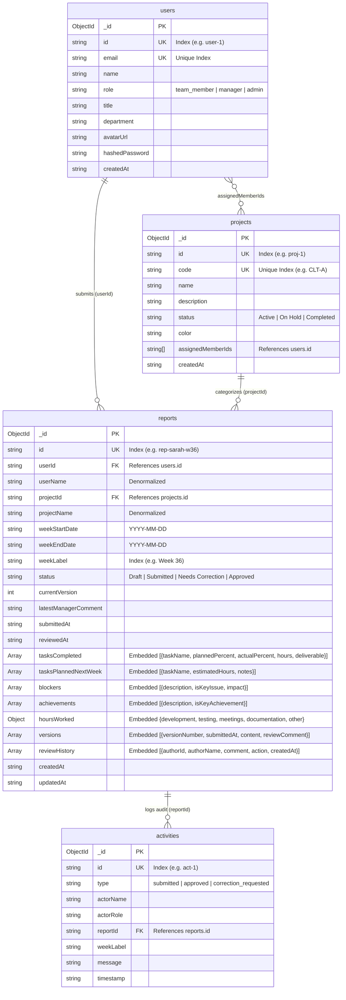

# Weekly Report Generator & Team Dashboard

[](https://fastapi.tiangolo.com)
[](https://www.mongodb.com)
[](https://react.dev)
[](https://github.com/pmndrs/zustand)
[](https://crewai.com)
[](https://langchain-ai.github.io/langgraph/)
[](https://groq.com)
[](https://www.docker.com)

An enterprise-grade, asynchronous Weekly Report Generator and Team Dashboard application built with **FastAPI**, **MongoDB**, **React 19**, **Zustand 5**, and **Tailwind CSS v4**.

Equipped with a multi-agent AI Intelligence layer powered by **CrewAI**, **LangGraph**, and **Groq LLM** to provide deep, real-time insights into team deliverables, blocker patterns, and compliance trends.

---

## 📖 Architecture & Design Documentation

| Document | Description |
| :--- | :--- |
| 👉 **[Backend Architecture Documentation](BACKEND_ARCHITECTURE.md)** | Deep dive into the 3-tier architecture, RBAC model, LangGraph/CrewAI agent flow, LiteLLM compatibility patches, and database indexing. |
| 👉 **[Frontend Architecture Documentation](FRONTEND_ARCHITECTURE.md)** | Detailed breakdown of Zustand stores, smart caching, component hierarchy, props contracts, and real calendar standardization. |
| 👉 **[Backend README & API Guide](backend/README.md)** | Python virtual environment setup, local execution, endpoints catalog, and configuration. |
| 👉 **[Frontend README & Setup Guide](frontend/README.md)** | React/Vite installation, scripts, component layout, and role simulator. |
| 🗄️ **[Database ER Diagram (Draw.io)](database_er_diagram.drawio)** | Native Draw.io XML file mapping all MongoDB collections, embedded schemas, and relationships. Open with [diagrams.net](https://app.diagrams.net). |

---

## 🌟 Key Capabilities

1. **Role-Based Access Control (RBAC)**:
   - **`team_member` (Contributor)**: Draft, edit, and submit weekly reports, view personal history, inspect team dashboard analytics, chat with AI assistant.
   - **`manager` (Engineering Lead)**: All contributor capabilities plus a dedicated Review Queue to approve or request changes with feedback comments.
   - **`admin` (System Administrator)**: Full control over user roles, project categories, and system-wide configurations.
2. **Weekly Report Lifecycle & Versioning**:
   - Save drafts without locking or triggering reviews.
   - Formal submission creates an immutable version snapshot.
   - Review actions (`approve` or `request_changes`) with manager comments stored in `reviewHistory`.
3. **Real ISO Calendar Standardization**:
   - Replaced fragile manual date ranges with real Monday-to-Sunday calendar weeks (`Week 36 (Aug 31 - Sep 06, 2026)`).
4. **Smart Client-Side Caching**:
   - Zustand stores cache stable entities (projects, users, audit feed) to eliminate redundant API network roundtrips when navigating between pages.
5. **Agentic AI Assistant**:
   - **CrewAI Chat Crew**: Autonomous agent equipped with 5 specialized tools (`FetchWeeklyReportsTool`, `FetchContributorReportTool`, `FetchTeamKpiMetricsTool`, `FetchTeamBlockersTool`, `FetchProjectsListTool`) to iteratively gather ground-truth facts.
   - **LangGraph StateGraph**: Orchestrates the QnA node and automatically triggers a 5-response rolling summarizer to maintain ongoing context.
   - **Session Chat Memory**: In-memory `MemorySaver` preserves dialogue while minimized/closed, and clears on browser refresh without database pollution.
6. **Live KPI Analytics & Visualization**:
   - Real-time submission compliance rate, approved count, pending review count, and open blockers.
   - Interactive charts built with Recharts (compliance trends, workload distributions, category breakdowns).

---

## 🗄️ Database Architecture & ER Diagram

The system employs a **Hybrid Document Pattern** in MongoDB:
- Stable author and project fields are denormalized inside `weekly_reports` to avoid expensive join/lookup stages.
- Tasks, deliverables, blockers, time breakdowns, and versions are embedded directly within parent report documents for atomic updates.



> 📄 **Visual Draw.io File**: Open [`database_er_diagram.drawio`](database_er_diagram.drawio) in [diagrams.net](https://app.diagrams.net) or VS Code.

---

## ⚡ Quick Start with Docker Compose (Recommended)

The entire application stack (MongoDB, FastAPI backend, and React frontend) is containerized with hot-reloading.

### 1. Clone the Repository
```bash
git clone https://github.com/NightKing-V/Weekly-Report-Generator-Team-Dashboard.git
cd Weekly-Report-Generator-Team-Dashboard
```

### 2. Configure Environment Variables
Create `.env` in the root (or in `backend/` and `frontend/reporting-app/`):
```bash
# In backend/.env
GROQ_API_KEY=gsk_your_actual_groq_api_key_here
GROQ_MODEL=qwen/qwen3.8-27b
```

### 3. Launch the Stack
```bash
docker compose up -d --build
```

### 4. Access the Services
| Service | URL | Description |
| :--- | :--- | :--- |
| **Frontend UI** | [http://localhost:5173](http://localhost:5173) | Single-page application with 1-click role switcher |
| **Backend API** | [http://localhost:8000](http://localhost:8000) | FastAPI REST API |
| **Swagger UI** | [http://localhost:8000/docs](http://localhost:8000/docs) | Interactive API documentation & testing |
| **ReDoc UI** | [http://localhost:8000/redoc](http://localhost:8000/redoc) | Alternative OpenAPI documentation |
| **MongoDB** | `localhost:27017` | Direct connection via MongoDB Compass |

To stop the containers:
```bash
docker compose down
```

---

## 🛠️ Manual Local Installation Guide

If you prefer to run services natively without Docker:

### Step 1: Start MongoDB
Ensure MongoDB 7.0+ is running locally on port `27017`:
```bash
# Run standalone MongoDB via Docker if not installed locally:
docker run -d --name mongodb -p 27017:27017 mongo:7.0
```

---

### Step 2: Set Up Backend

1. Navigate to the backend directory:
   ```bash
   cd backend
   ```
2. Create and activate a virtual environment:
   - **Windows (PowerShell)**:
     ```powershell
     python -m venv venv
     .\venv\Scripts\Activate.ps1
     ```
   - **macOS / Linux**:
     ```bash
     python3 -m venv venv
     source venv/bin/activate
     ```
3. Install dependencies:
   ```bash
   pip install -r requirements.txt
   ```
4. Configure `backend/.env`:
   ```ini
   MONGODB_URI=mongodb://localhost:27017/team_dashboard?authSource=admin
   MONGODB_DB_NAME=team_dashboard
   JWT_SECRET_KEY=supersecretjwtsecretkeyformonthlyreporting123456
   JWT_ALGORITHM=HS256
   ACCESS_TOKEN_EXPIRE_MINUTES=1440
   GROQ_API_KEY=gsk_your_actual_groq_api_key_here
   GROQ_MODEL=qwen/qwen3.8-27b
   GROQ_MODEL_SMALL=qwen/qwen3.8-27b
   GROQ_MODEL_LARGE=qwen/qwen3.8-27b
   CORS_ORIGINS=http://localhost:5173,http://127.0.0.1:5173
   ```
5. Launch the backend server:
   ```bash
   uvicorn main:app --reload --port 8000
   ```
   *(The database is automatically seeded with demo users, projects, and reports on startup!)*

---

### Step 3: Set Up Frontend

1. Open a new terminal and navigate to the frontend app:
   ```bash
   cd frontend/reporting-app
   ```
2. Install dependencies:
   ```bash
   npm install
   ```
3. Verify environment configuration (`frontend/reporting-app/.env`):
   ```ini
   VITE_API_BASE_URL=http://localhost:8000/api
   ```
4. Start the development server:
   ```bash
   npm run dev
   ```
5. Open your browser at **[http://localhost:5173](http://localhost:5173)**.

---

## 👥 Demo User Accounts (Pre-Seeded)

The system is pre-populated with realistic engineering team accounts. You can log in using these credentials or use the **1-Click User Switcher** in the top navigation bar:

| Name | Email | Password | Role | Responsibilities |
| :--- | :--- | :--- | :--- | :--- |
| **System Admin** | `admin@team.com` | `password123` | `admin` | Manages user roles and workspace project codes |
| **Alex Rivera** | `alex.rivera@team.com` | `password123` | `manager` | Reviews team reports, approves or requests changes |
| **Sarah Chen** | `sarah.chen@team.com` | `password123` | `team_member` | Submits reports for *Client A Portal* (CAP) |
| **Michael Scott** | `michael.scott@team.com` | `password123` | `team_member` | Has active *Needs Correction* report feedback |

---

## 🤖 AI Assistant & Agentic Tools

The AI assistant can be accessed by clicking the **"AI Assistant"** button in the top navigation bar. It is powered by:

1. **CrewAI Chat Crew (`ReportQnACrew`)**:
   - `FetchWeeklyReportsTool`: Searches team reports by week, project, status, or keyword.
   - `FetchContributorReportTool`: Fetches detailed updates for a specific team member.
   - `FetchTeamKpiMetricsTool`: Computes live compliance percentages and blocker metrics.
   - `FetchTeamBlockersTool`: Identifies unresolved issues and critical blockers.
   - `FetchProjectsListTool`: Lists active project codes and categories.
2. **LangGraph StateGraph (`chat_graph`)**:
   - Routes user queries to the CrewAI QnA node.
   - Evaluates a conditional edge: every 5 responses, invokes the **Rolling Summarizer** to condense dialogue into an ongoing factual summary.
   - Employs in-memory `MemorySaver` so conversation is maintained during navigation/minimize, but resets cleanly upon page refresh.

---

## 📂 Project Structure

```
Weekly-Report-Generator-Team-Dashboard/
├── backend/
│   ├── app/
│   │   ├── clients/database/   # Motor async MongoDB client & auto-seeder
│   │   ├── data/               # Seed dataset (users, projects, reports, activities)
│   │   ├── llm/                # LLM Provider Factory, Groq client & LiteLLM patches
│   │   ├── middleware/         # JWT authentication & RBAC dependency guards
│   │   ├── models/             # Pydantic v2 schemas
│   │   ├── repositories/       # Async MongoDB queries, filtering, pagination
│   │   ├── routes/             # REST controllers (users, reports, chat)
│   │   └── services/           # Business logic, KPI engine, LangGraph & CrewAI
│   ├── tests/                  # Automated test suites
│   ├── Dockerfile
│   ├── main.py                 # FastAPI application & lifespan
│   ├── requirements.txt        # Python dependencies
│   └── README.md               # Dedicated Backend Setup Guide
│
├── frontend/
│   ├── reporting-app/
│   │   ├── src/
│   │   │   ├── components/     # UI atoms, report forms, analytics charts, AI modal
│   │   │   ├── hooks/          # Custom hooks (useFetch.ts)
│   │   │   ├── pages/          # Application views (Contributor, Review, Dashboard)
│   │   │   ├── props/          # TypeScript props contracts
│   │   │   ├── services/       # Remote API client (api.ts) with ApiError handling
│   │   │   ├── store/          # Zustand store hooks (auth, reports, notification)
│   │   │   ├── types/          # Domain entity interfaces
│   │   │   └── utils/          # Real calendar calculations & formatters
│   │   ├── package.json
│   │   └── README.md           # App package guide
│   ├── Dockerfile
│   └── README.md               # Dedicated Frontend Setup Guide
│
├── database_er_diagram.drawio  # Visual MongoDB ER Diagram (Draw.io XML)
├── BACKEND_ARCHITECTURE.md     # Deep Backend System Design Document
├── FRONTEND_ARCHITECTURE.md    # Deep Frontend Architecture Document
├── docker-compose.yml          # Container orchestration for all services
└── README.md                   # Project Root Overview & Installation Guide
```

---

## 📜 License

This project is developed for engineering team weekly progress tracking and management review workflows.
